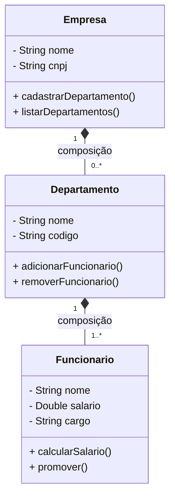

# Diagrama de Classes UML
## Fundamentos e Práticas

---

# O que é UML?
- Unified Modeling Language
- Linguagem padrão para modelagem de sistemas
- Utilizada no desenvolvimento de software
- Documentação visual do sistema

---

# Diagrama de Classes
## Conceito Base
- Representa a estrutura estática do sistema
- Mostra classes, atributos, métodos e relacionamentos
- Fundamental para orientação a objetos

---

# Anatomia de uma Classe

```
+-----------------+
|     Pessoa      |  ← Nome da Classe
+-----------------+
| - nome: String  |  ← Atributos
| - idade: int    |
| - bi: String   |
+-----------------+
| + getNome()     |  ← Métodos
| + setNome()     |
| + getIdade()    |
+-----------------+
```

---

# Modificadores de Acesso

- (+) Público
  - Acessível por qualquer classe
- (-) Privado
  - Acessível apenas dentro da própria classe
- (#) Protegido
  - Acessível pela classe e suas subclasses

---

# Tipos de Relacionamentos

## 1. Herança
```
    Animal
      ↑
    Cachorro
```
- Representada por uma seta com triângulo
- Indica que uma classe herda de outra
- Exemplo: Cachorro é um Animal

## 2. Associação
```
Professor ─────── Turma
```
- Linha contínua simples
- Indica que as classes têm uma relação

## 3. Agregação
```
Turma ◇──────── Aluno
```
- Losango vazio
- O todo pode existir sem a parte
- Exemplo: Turma pode existir sem alunos

## 4. Composição
```
Carro ♦──────── Motor
```
- Losango preenchido
- O todo não existe sem a parte
- Exemplo: Carro precisa de motor

---

# Multiplicidade

- 1..1 : Exatamente um
- 0..1 : Zero ou um
- 1..* : Um ou mais
- 0..* : Zero ou mais
- n..m : De n até m

Exemplo:
```
Turma "1" ────── "1..*" Aluno
```

---

# Exemplo Prático

---

# Boas Práticas

1. Mantenha o diagrama simples e claro
2. Use nomes significativos
3. Inclua apenas atributos e métodos relevantes
4. Organize o layout de forma lógica
5. Documente relacionamentos importantes

---

<!-- 
# Exercício Prático

Crie um diagrama de classes para um sistema de biblioteca com:
- Livro
- Autor
- Usuário
- Empréstimo

Considere:
- Que relações existem entre estas classes?
- Quais atributos são importantes?
- Quais métodos são necessários?

--- -->

# Dicas para Modelagem

1. Comece identificando as classes principais
2. Determine os atributos essenciais
3. Adicione os métodos necessários
4. Estabeleça os relacionamentos
5. Revise e refine o diagrama

---

# Ferramentas Recomendadas

- Draw.io (gratuito, online)
- StarUML
- Mermaid
- Visual Paradigm
- Lucidchart
- PlantUML

---

# Recursos Adicionais

## Links Úteis:
- [UML.org - Documentação oficial](uml.org) 
- [Diagrama de Classes - Mermaid](https://mermaid.js.org/syntax/classDiagram.html)

<!-- 
## Livros Recomendados:
-  -->
---

# Conclusão

- Diagramas de classe são fundamentais
- Facilitam a comunicação entre equipes
- Documentam a estrutura do sistema
- Base para um bom design orientado a objetos
