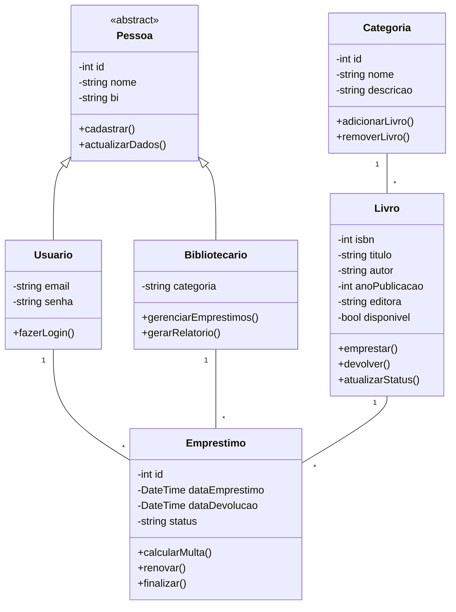

```mermaid
classDiagram
    class Pessoa {
        <<abstract>>
        -int id
        -string nome
        -string bi
        +cadastrar()
        +actualizarDados() 
    }

    class Usuario {
        -string email
        -string senha
        +fazerLogin() 
           }

    class Livro {
        -int isbn
        -string titulo
        -string autor
        -int anoPublicacao
        -string editora
        -bool disponivel
        +emprestar()
        +devolver()
        +atualizarStatus()
    }

    class Emprestimo {
        -int id
        -DateTime dataEmprestimo
        -DateTime dataDevolucao
        -string status
        +calcularMulta()
        +renovar()
        +finalizar()
    }

    class Categoria {
        -int id
        -string nome
        -string descricao
        +adicionarLivro()
        +removerLivro()
    }

    class Bibliotecario {
        -string categoria
        +gerenciarEmprestimos() 
        +gerarRelatorio() 
    }

    
    Pessoa <|-- Usuario
    Pessoa <|-- Bibliotecario
    Usuario "1" -- "*" Emprestimo
    Livro "1" -- "*" Emprestimo
    Categoria "1" -- "*" Livro
    Bibliotecario "1" -- "*" Emprestimo

```
