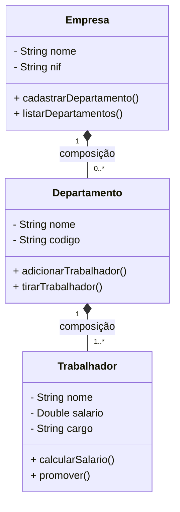

# Diagrama de Classes UML
## Fundamentos e Práticas
---
# O que é UML?
- Unified Modeling Language
- Linguagem padrão para modelar sistemas
- Usada no desenvolvimento de software
- Documentação visual do sistema
---
# Diagrama de Classes
## Conceito Base
- Representa a estrutura estática do sistema
- Mostra classes, atributos, métodos e ligações
- Fundamental pa orientação a objetos
---
# Anatomia duma Classe
```
+-----------------+
|     Pessoa      |  ← Nome da Classe
+-----------------+
| - nome: String  |  ← Atributos
| - idade: int    |
| - bi: String    |
+-----------------+ 
| + getNome()     |  ← Métodos
| + setNome()     |
| + getIdade()    |
+-----------------+
```

---
# Modificadores de Acesso
- (+) Público
  - Acessível por qualquer classe
- (-) Privado
  - Acessível apenas dentro da própria classe
- (#) Protegido
  - Acessível pela classe e suas subclasses
---

# Tipos de Relacionamentos

## 1. Herança
```
    Animal
      ↑
     Cão
```
- Representada por seta com triângulo
- Indica que uma classe herda doutra
- Exemplo: Cão é um Animal
  
## 2. Associação
```
Professor ─────── Turma
```
- Linha contínua simples
- Indica que as classes têm ligação

## 3. Agregação
```
Turma ◇──────── Aluno
```
- Losango vazio
- O todo pode existir sem a parte
- Exemplo: Turma pode existir sem alunos
  
## 4. Composição
```
Carro ♦──────── Motor
```
- Losango cheio
- O todo não existe sem a parte
- Exemplo: Carro precisa de motor
---
# Multiplicidade
- 1..1 : Exactamente um
- 0..1 : Zero ou um
- 1..* : Um ou mais
- 0..* : Zero ou mais
- n..m : De n até m
Exemplo:
```
Turma "1" ────── "1..*" Aluno
```
---
# Exemplo Prático

---
# Boas Práticas
1. Mantenha o diagrama simples e claro
2. Use nomes com sentido
3. Inclua só atributos e métodos importantes
4. Organize o layout de forma lógica
5. Documente ligações importantes
---
# Dicas pa Modelação
1. Começa identificando as classes principais
2. Determina os atributos essenciais
3. Adiciona os métodos necessários
4. Estabelece as ligações
5. Revê e aperfeiçoa o diagrama
---
# Ferramentas Recomendadas
- Draw.io (gratuito, online)
- StarUML
- Mermaid
- Visual Paradigm
- Lucidchart
- PlantUML
---
# Recursos Adicionais
## Links Úteis:
- [UML.org - Documentação oficial](uml.org) 
- [Diagrama de Classes - Mermaid](https://mermaid.js.org/syntax/classDiagram.html)
---
# Conclusão
- Diagramas de classe são fundamentais
- Facilitam a comunicação entre equipas
- Documentam a estrutura do sistema
- Base pa um bom design orientado a objetos
